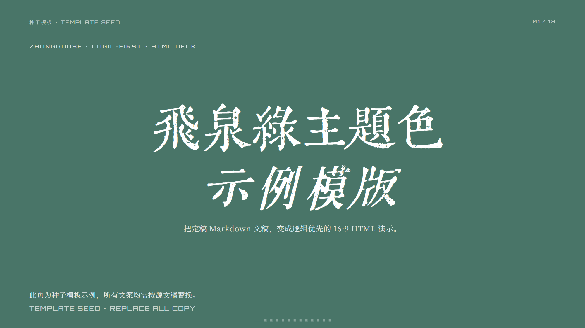
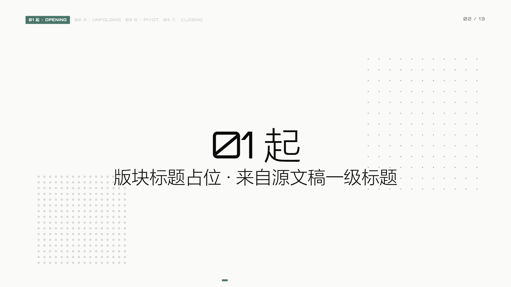
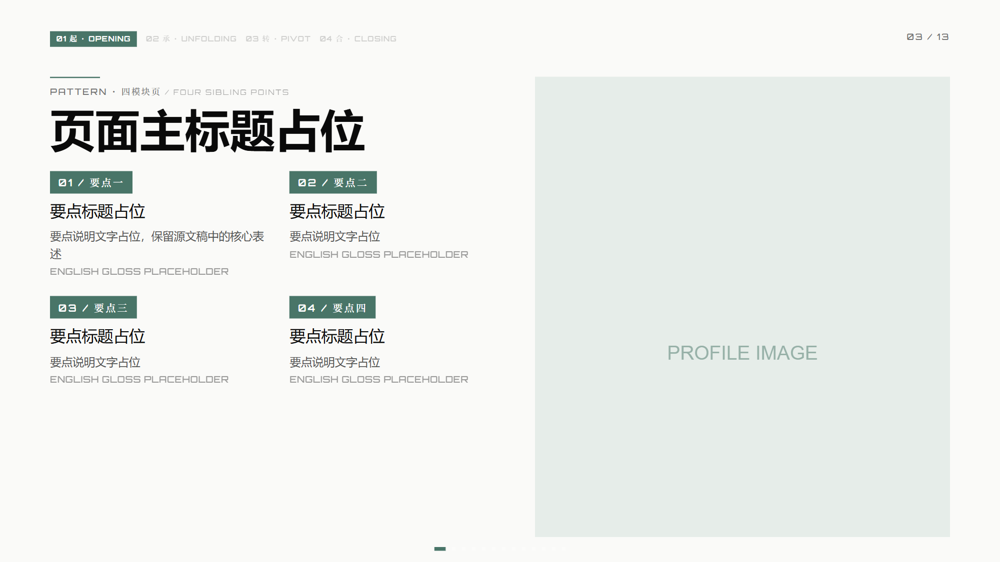
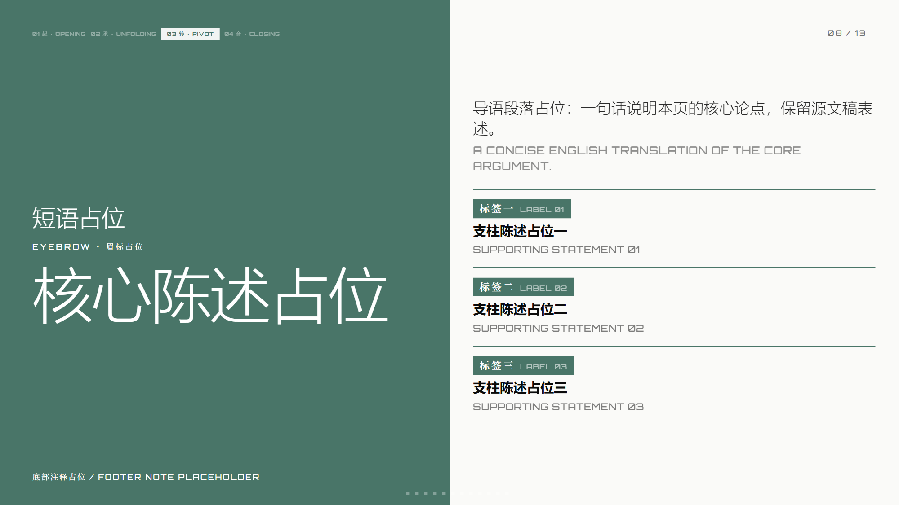
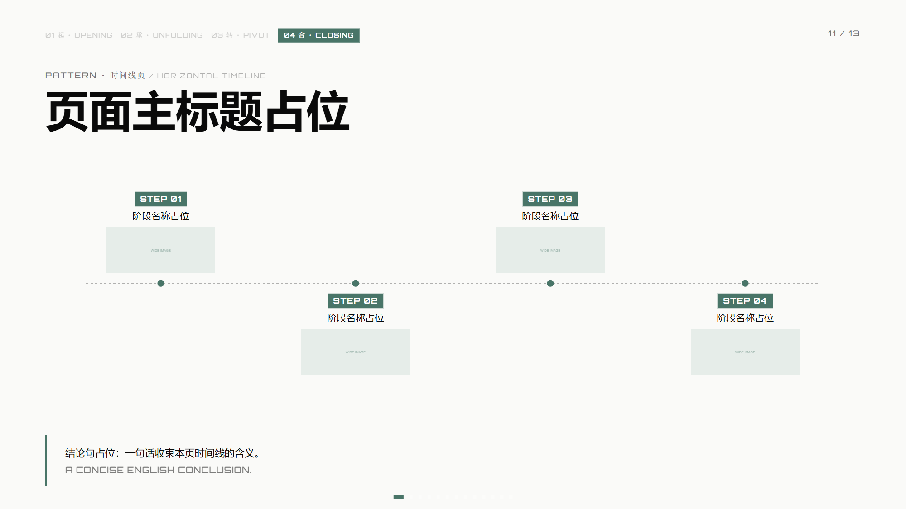
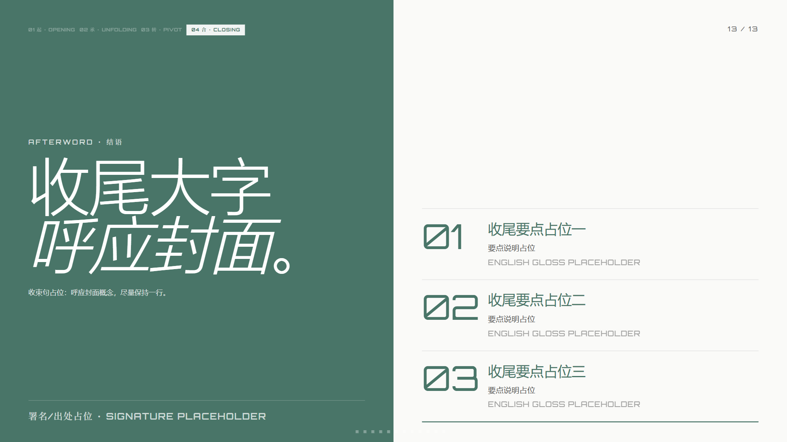
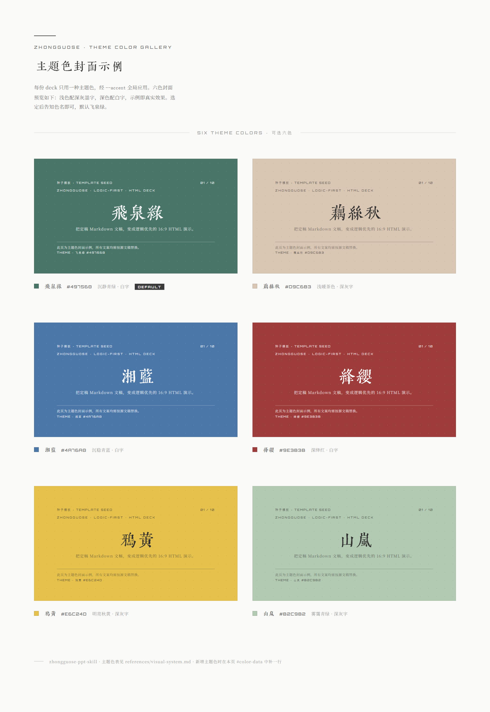

# 中国色汇报演示 Skill

以原稿章法为骨架，中国传统色彩为气韵，生成中文主导、中英双语、具备本地运行核心的 HTML 演示，并为 PPT/PPTX 提供汇报逻辑与版式框架。

Build source-faithful, Chinese-led bilingual presentation systems with traditional Chinese color themes. Generate interactive HTML decks with local runtime assets, or use the same logic and layout framework for PPT production.

## 效果预览 / Preview

种子模板 `assets/template-zhongguose/index.html` 自带完整 16:9 交互外壳与核心版式样例。以下为真实页面截图（占位文案需按源文稿替换）。

The seed template ships a full 16:9 interactive shell and core layout samples. Screenshots below are from the real HTML (placeholder copy must be replaced from your manuscript).

**封面 · Cover**



**章节扉页 · Section divider**（左上框架导航高亮当前版块）



**内容页 · Content layouts**

| 四模块 + 图 | 左右分屏陈述 |
| --- | --- |
|  |  |

| 时间线 | 收尾页 |
| --- | --- |
|  |  |

### 本地打开 HTML 示例 / Open the live demos

克隆仓库后可直接在浏览器中打开（建议用本地静态服务，避免部分字体路径限制）：

```bash
# 交互式种子模板（滚轮 / 方向键翻页，Esc 索引，B 静帧）
# Interactive seed deck (wheel/arrow keys, Esc overview, B static mode)
start skills/zhongguose-ppt-skill/assets/template-zhongguose/index.html

# 六套主题色封面对照
# Six theme-color cover gallery
start skills/zhongguose-ppt-skill/assets/theme-cover-gallery.html
```

macOS / Linux 可将 `start` 换成 `open` 或 `xdg-open`。更稳妥的预览方式：

```bash
node skills/zhongguose-ppt-skill/scripts/preview-deck.mjs \
  skills/zhongguose-ppt-skill/assets/template-zhongguose/index.html
```

截图源文件位于 [`docs/preview/`](docs/preview/)。修改模板后可用：

```bash
npm install --include=dev
node scripts/capture-preview.mjs
```

## 主题色一览 / Theme colors

每份 deck **只用一种**主题色，通过 `--accent` / `--accent-on` 全局跟随。浅色主题配墨色字，深色主题配白字，保证对比度。

One theme per deck, applied globally via `--accent` and `--accent-on`. Light themes use ink text; dark themes use white text.



| 名称 | accent | accent-on | 气质 |
| --- | --- | --- | --- |
| 飞泉绿 / Feiquan Green | `#497568` | 白字 | 沉静青绿 · **默认** |
| 藕丝秋 / Lotus Silk Autumn | `#D9C6B3` | 墨字 | 温润浅茶 |
| 湘蓝 / Xiang Blue | `#4A76A8` | 白字 | 沉稳青蓝 |
| 绛缨 / Crimson Tassel | `#9E3B3B` | 白字 | 深绛有力 |
| 鸦黄 / Crow Yellow | `#E6C24D` | 墨字 | 明亮秋黄 |
| 山岚 / Mountain Mist | `#B2C9B2` | 墨字 | 雾霭青绿 |

完整 token 与使用规则见 [`skills/zhongguose-ppt-skill/references/visual-system.md`](skills/zhongguose-ppt-skill/references/visual-system.md)。  
选色时打开 [`theme-cover-gallery.html`](skills/zhongguose-ppt-skill/assets/theme-cover-gallery.html) 对照真实封面效果。

## 与其他 PPT Skill 的差异 / What makes this different

本 Skill 的产品与交互概念参考了 [guizang-ppt-skill](https://github.com/op7418/guizang-ppt-skill)，但定位与交付物不同：不是「通用 Markdown → 幻灯片套壳」，而是 **中式文化汇报体系**——逻辑在先、中国色为气、中文为主。

Inspired by guizang-ppt-skill, but positioned as a Chinese-cultural reporting system: logic first, one traditional color, Chinese-led bilingual hierarchy—not a generic Markdown-to-slides wrapper.

| 维度 | 本 Skill（zhongguose） | 常见通用 PPT Skill |
| --- | --- | --- |
| 触发边界 | 中华文化内容 **或** 中国色/中式审美诉求；仅中文或中国市场 **不** 自动触发 | 通常凡 Markdown/大纲即触发 |
| 第一责任 | **忠于源文稿逻辑**；先锁定文稿与润色尺度，再做页级架构 | 往往先套模板版式，再填文字 |
| 章节结构 | 从源文证据提炼分组；不默认 WHY/WHAT/HOW 或起承转合 | 易套固定叙事模板 |
| 视觉系统 | **六套中国传统色** + 纸白秩序 + 齐伋体封面字；一 deck 一色 | 多主题混搭或西式配色板 |
| 中英关系 | **中文主导**：主标题纯中文；英文更小、作辅助，不与中文等大争锋 | 常做成同级双语双标题 |
| 结构导航 | 左上 **框架导航** 来自一级版块，标明「整份逻辑 + 当前所在」 | 多为页码或装饰标签 |
| 交付模式 | **HTML 交互演示** 与 **PPT 逻辑/版式参考** 双模式；本身不写 `.pptx` | 多只追求生成幻灯片文件 |
| 离线核心 | Motion / Lucide / 封面 WOFF2 **本地分发**；断网仍可翻页与阅读 | 常重度依赖 CDN |
| 质量门禁 | 字体子集与字形、主题对比度、结构合同、双分辨率溢出检查 | 校验较弱或仅人工预览 |

**一句话亮点 / Highlights**

1. **逻辑优先，不是装饰优先** — 文稿锁定 → 源逻辑地图 → 逐页内容合同 → 再选版式与中国色。  
2. **中国色可感知** — 六色封面色卡 + 真实模板页，选色所见即所得。  
3. **中文主导的双语** — 适合国内汇报、对外简介并存的场景，而不是「两行一样大的中英文」。  
4. **框架导航当结构工具** — 观众始终知道整份汇报讲什么、讲到哪。  
5. **HTML 可演示，PPT 可承接** — 要现场翻页用 HTML；要进 Keynote/PowerPoint 则交付逻辑与版式规范。  
6. **可校验、可复用** — CI 与脚本覆盖包结构、字体、资源和视口溢出。

## 适用场景 / Use cases

当演示任务需要梳理叙事逻辑、章节、页级结构或版式，并且符合以下任一条件时使用：

- 内容体现中华文化、传统文化或地域文化；
- 用户要求中国色、中国风、中式或东方审美；
- 用户点名本 Skill、模板或框架导航格式。

Use it when presentation logic or layout work concerns Chinese culture, traditional or regional culture, Chinese-color or Eastern aesthetics, or when the Skill and its framework navigation are explicitly requested.

仅使用中文或只涉及中国市场，并不会自动触发。通用 Markdown 转 PPT 也不会自动触发。

Chinese language or a China-market topic alone does not trigger the Skill. Generic Markdown-to-PPT conversion does not trigger it either.

## 能力 / Capabilities

- 从已确认文稿提炼汇报逻辑，不套用固定分组；
- 建立可追溯的章节、导航和逐页内容合同；
- 默认生成中文突出、英文缩小辅助的双语层级；
- 使用六套中国传统主题色之一；
- 在模板中本地分发 Motion、Lucide 和封面字体；断网时核心翻页与内容仍可用；
- 为 PPT/PPTX 输出结构与版式参考，但不直接创建 .pptx；
- 校验字体许可证、主题对比度、本地资源和双分辨率页面溢出。

It derives source-based grouping, creates traceable slide contracts, uses Chinese-led bilingual hierarchy, supports six traditional color themes, ships local runtime assets, guides PPT layout, and validates fonts, package integrity, assets, and overflow.

## 安装 / Installation

使用 Agent Skills CLI：

```bash
npx skills add tanglele110-hash/zhongguose-ppt-skill --skill zhongguose-ppt-skill
```

克隆仓库后，也可以直接从本地目录安装：

```bash
npx skills add . --skill zhongguose-ppt-skill
```

也可以手动把 `skills/zhongguose-ppt-skill` 复制到支持 Agent Skills 的 skills 目录。

You may also copy `skills/zhongguose-ppt-skill` into the skills directory of any Agent Skills-compatible tool.

## HTML 运行依赖 / HTML requirements

- Node.js 18 或更高版本；
- Python 3.10 或更高版本；
- FontTools、Brotli 与 Zopfli；
- Chrome、Edge 或 Chromium，用于自动浏览器 QA。

```bash
python -m pip install -r skills/zhongguose-ppt-skill/requirements.txt
npm ci --include=dev
```

PPT 结构参考模式不需要上述运行依赖。

PPT framework mode does not require these runtime dependencies.

模板优先加载本地 Motion、Lucide 与 `Zhongguose Cover` 封面字体。Inter、JetBrains Mono、LXGW WenKai、Noto Serif SC 和 Orbitron 由 Google Fonts 提供；断网或网络受限时会回退到系统字体，因此内容与交互仍可用，但字形效果不会完全一致。本地 Motion/Lucide 加载失败时，模板还提供 jsDelivr 回退。

The template loads local Motion, Lucide, and the `Zhongguose Cover` font first. Other web fonts come from Google Fonts with system-font fallback. jsDelivr is an additional fallback only if local Motion or Lucide loading fails.

## 快速使用 / Quick use

向 Agent 提供文稿或大纲，并说明：

```text
使用 zhongguose-ppt-skill，把这份文稿整理成中国色主题的 HTML 汇报。
```

或者：

```text
使用 zhongguose-ppt-skill，提炼这份中式文化汇报的 PPT 章节、导航、逐页结构和版式规范。
```

HTML 完成后，通过本地服务器预览：

```bash
node skills/zhongguose-ppt-skill/scripts/preview-deck.mjs path/to/index.html
```

## 输出 / Outputs

**HTML**

```text
index.html
assets/
  fonts/
    zhongguose-cover.woff2
    zhongguose-cover.manifest.json
    OFL-1.1.txt
    FONT-NOTICE.txt
  motion.min.js
  lucide.min.js
  licenses/
```

**PPT 参考**

- 原稿逻辑地图；
- 章节与导航；
- 逐页内容合同；
- 版式、字号、主题色和素材说明。

## 验证 / Validation

仓库 CI 会执行：

- Skill 包结构检查；
- Node 脚本语法检查；
- 逐稿字体子集化；
- HTML 结构与资源检查；
- 六套主题封面名称的字体字形检查；
- 1920×1080 与 1366×768 浏览器溢出检查。

CI validates package structure, script syntax, font subsetting, all six gallery-name glyphs, deck structure, local assets, and two browser viewports.

## 署名 / Credits

- 制作：木渡川 / Created by 木渡川 (Muduchuan).
- 产品思路与交互概念参考 guizang 的 guizang-ppt-skill：  
  https://github.com/op7418/guizang-ppt-skill
- 封面字体源自 Lingdong Huang 的 qiji-font：  
  https://github.com/LingDong-/qiji-font

## 许可证 / License

本仓库自有代码使用 MIT License。字体使用 SIL Open Font License 1.1；Motion 使用 MIT License；Lucide 使用 ISC License，其部分 Feather 派生图标使用 MIT License。详情见 [THIRD_PARTY_NOTICES.md](THIRD_PARTY_NOTICES.md)，以及模板 `assets/licenses/` 和字体目录中的许可证文件。

Original repository code is MIT-licensed. The font is licensed under SIL OFL 1.1, Motion under MIT, and Lucide under ISC with MIT-licensed Feather-derived icons. See THIRD_PARTY_NOTICES.md and the license files shipped beside the bundled assets.
